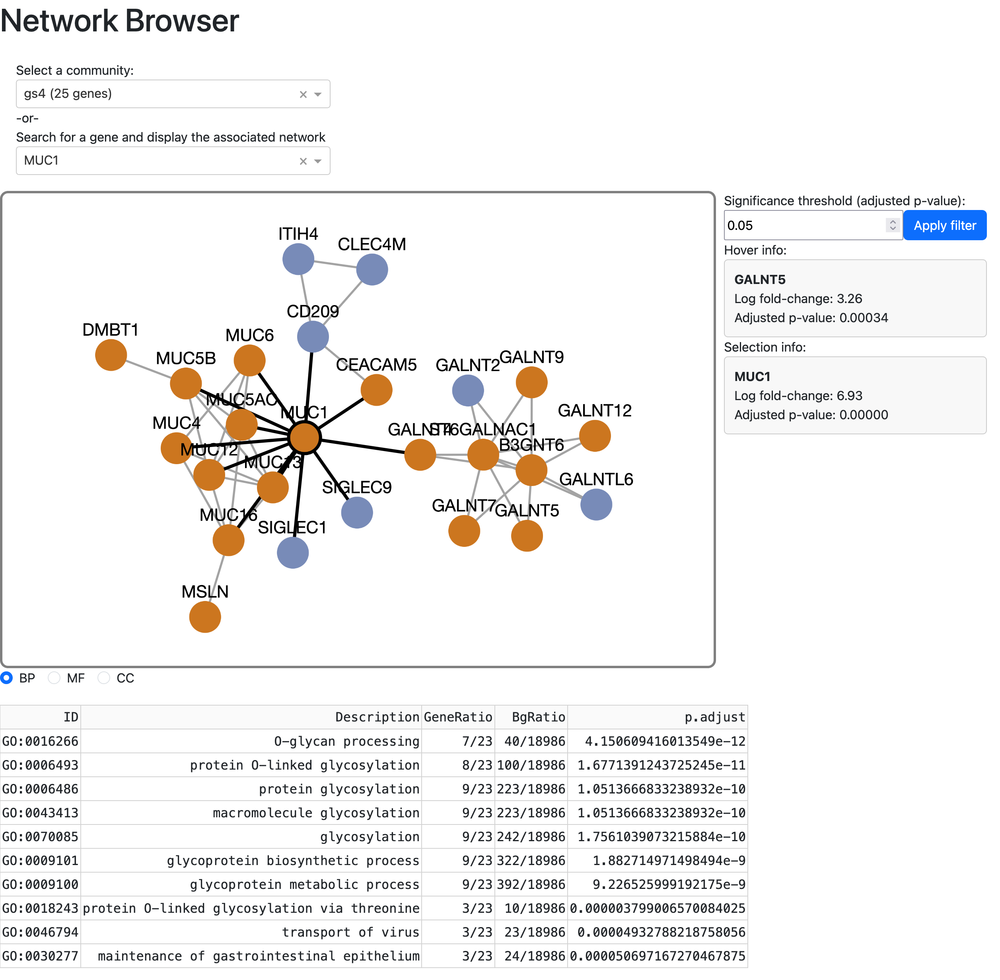

# TCGA transcriptome + methylation discovery and visualization

This repository contains a Nextflow script for processing RNA-seq and methylation data obtained from the The Cancer Genome Atlas (TCGA).

The original intent was to study how differing MUC1 levels might affect the transcriptome landscape (including how methylation patterns might suggest regulation), but the process is completely general and may be used to study your target of interest.

After selecting a candidate gene and cancer cohort (among several other parameters), the pipeline will stratify the cohort based on the expression of the target gene. It will then perform standard differential expression and pathway analyses to see how relatively low- and high-expression of the target gene affects the transcriptome.

Following the standard analyses, we use protein-protein interaction from stringDB (https://string-db.org/) to overlay high-confidence interactions on the differentially expressed transcripts. These networks are then clustered to discovery potentially related gene modules which can then be visualized with a companion dashboard application. 

Finally, we take companion methylation data (chip/probe based) and test whether differences in methylation "beta" values are associated with low or high expression of our target gene. That is then followed by testing for an association between those differentially methylated probes and a set of genes (e.g. are the methylation values of this probe associated with the expression of any nearby genes?). [More details](#methylation-details) on this process below.

## To run:

**Prerequisites:**
- Nextflow is installed (https://www.nextflow.io/docs/latest/getstarted.html)
- Docker is installed (software is containerized in Docker images)

Next we set the pipeline parameters. Copy `params.json.tmpl` and fill in variables as required. For a detailed explanation, see [parameters](#input-parameters)

Now you can run with:
```
nextflow run main.nf -c <NEXTFLOW CONFIG> -params-file <PARAMS JSON>
```

#### Output files

An example of the output folder (for a single cancer type):
```
results/250822.172517
└── TCGA-CHOL
    ├── annotations
    │   └── TCGA-CHOL.annotations.ENSG00000185499_0.3_0.7.tsv
    ├── dge_results
    │   ├── TCGA-CHOL.deseq2_results.ENSG00000185499_0.3_0.7.high_vs_low.symbol_remapped.tsv
    │   └── TCGA-CHOL.deseq2_results.ENSG00000185499_0.3_0.7.high_vs_low.tsv
    ├── gsea
    │   ├── TCGA-CHOL.ENSG00000185499_0.3_0.7.gsea_results.zip
    │   ├── TCGA-CHOL.ENSG00000185499_0.3_0.7.high_vs_low.cls
    │   └── TCGA-CHOL.ENSG00000185499_0.3_0.7.high_vs_low.gct
    ├── gsea_preranked
    │   └── TCGA-CHOL.ENSG00000185499_0.3_0.7.gsea_preranked_results.zip
    ├── methylation
    │   ├── TCGA-CHOL.betas.enhancer_probes.reformatted_sample_id.tsv
    │   ├── TCGA-CHOL.betas.promoter_probes.reformatted_sample_id.tsv
    │   ├── TCGA-CHOL.enhancer_probes.supervised.hyper_na0.5.tsv
    │   ├── TCGA-CHOL.enhancer_probes.supervised.hyper.probe_to_gene_results.tsv
    │   ├── TCGA-CHOL.enhancer_probes.supervised.hypo_na0.5.tsv
    │   ├── TCGA-CHOL.enhancer_probes.supervised.hypo.probe_to_gene_results.tsv
    │   ├── TCGA-CHOL.methylation_data.rds
    │   ├── TCGA-CHOL.norm_counts.reformatted_sample_id.tsv
    │   ├── TCGA-CHOL.promoter_probes.supervised.hyper_na0.5.tsv
    │   ├── TCGA-CHOL.promoter_probes.supervised.hyper.probe_to_gene_results.tsv
    │   ├── TCGA-CHOL.promoter_probes.supervised.hypo_na0.5.tsv
    │   └── TCGA-CHOL.promoter_probes.supervised.hypo.probe_to_gene_results.tsv
    ├── normalized_counts
    │   ├── TCGA-CHOL.deseq2_norm_counts.all.tsv
    │   └── TCGA-CHOL.deseq2_norm_counts.symbol_remapped.all.tsv
    ├── ppi_networks
    │   ├── dge_only.pkl
    │   ├── full.pkl
    │   ├── louvain_communities.dge_only.gmt
    │   ├── louvain_communities.dge_only.h5
    │   ├── louvain_communities.full.gmt
    │   ├── louvain_communities.full.h5
    │   ├── network_stats.dge_only.tsv
    │   └── network_stats.full.tsv
    └── raw_data
        ├── TCGA-CHOL.metadata.tsv
        └── TCGA-CHOL.raw_counts.tsv
```
**Output file descriptions:**

This has annotations about which samples were in the lowest and highest quantiles (as set by your input paramters `low_q`, `high_q`):
```
    ├── annotations
    │   └── TCGA-CHOL.annotations.ENSG00000185499_0.3_0.7.tsv
```

These are both tables of differentially expressed genes. One is expressed in ENSG/Ensembl IDs, and the other has been mapped to gene symbols:
```
    ├── dge_results
    │   ├── TCGA-CHOL.deseq2_results.ENSG00000185499_0.3_0.7.high_vs_low.symbol_remapped.tsv
    │   └── TCGA-CHOL.deseq2_results.ENSG00000185499_0.3_0.7.high_vs_low.tsv
```

This has the traditional gene-set enrichment analysis. The zip file contains all the usual HTML files and associated figures. The `cls` and `gct` are the input files used to run GSEA:
```
    ├── gsea
    │   ├── TCGA-CHOL.ENSG00000185499_0.3_0.7.gsea_results.zip
    │   ├── TCGA-CHOL.ENSG00000185499_0.3_0.7.high_vs_low.cls
    │   └── TCGA-CHOL.ENSG00000185499_0.3_0.7.high_vs_low.gct
```
This has the results from the pre-ranked GSEA analysis. The `rnk` file has the ranking of the genes, which is determined by a combination of adjusted p-value and the direction of the log-fold change:
```
    ├── gsea_preranked
    │   ├── TCGA-CHOL.ENSG00000185499_0.3_0.7.gsea_preranked_results.zip
    │   └── TCGA-CHOL.ENSG00000185499_0.3_0.7.gsea_preranked_results.rnk
```

This has the results from the differential methylation testing. For each probe "style" (>=1 of those, e.g. distal enhancers, promoter-proximal, etc.), we test whether we observe hypo or hypermethylation associations with the low or high-expressing cohort of our target gene. Those tests are in the files named `<TCGA class>.<probe style>.supervised.<hypo|hyper>_na0.5.tsv`. The files named `<TCGA class>.<probe style>.supervised.<hypo|hyper>.probe_to_gene_results.tsv` subsequently take the differentially expressed probes and test for association with "nearby" genes. See the [methylation section](#methylation-details) below for further details.
```
    ├── methylation
    │   ├── TCGA-CHOL.betas.enhancer_probes.reformatted_sample_id.tsv
    │   ├── TCGA-CHOL.betas.promoter_probes.reformatted_sample_id.tsv
    │   ├── TCGA-CHOL.enhancer_probes.supervised.hyper_na0.5.tsv
    │   ├── TCGA-CHOL.enhancer_probes.supervised.hyper.probe_to_gene_results.tsv
    │   ├── TCGA-CHOL.enhancer_probes.supervised.hypo_na0.5.tsv
    │   ├── TCGA-CHOL.enhancer_probes.supervised.hypo.probe_to_gene_results.tsv
    │   ├── TCGA-CHOL.methylation_data.rds
    │   ├── TCGA-CHOL.norm_counts.reformatted_sample_id.tsv
    │   ├── TCGA-CHOL.promoter_probes.supervised.hyper_na0.5.tsv
    │   ├── TCGA-CHOL.promoter_probes.supervised.hyper.probe_to_gene_results.tsv
    │   ├── TCGA-CHOL.promoter_probes.supervised.hypo_na0.5.tsv
    │   └── TCGA-CHOL.promoter_probes.supervised.hypo.probe_to_gene_results.tsv
```

This has normalized counts following DESeq2's median-based normalization. One version has the original ENSG/Ensembl IDs, the other is mapped to the gene symbol:
```
    ├── normalized_counts
    │   ├── TCGA-CHOL.deseq2_norm_counts.all.tsv
    │   └── TCGA-CHOL.deseq2_norm_counts.symbol_remapped.all.tsv
```

This has the results of the stringDB network + clustering analysis. There are two versions of each file. The files marked "dge_only" are networks created where both genes/proteins associated with each edge are differentially expressed. The "full" files indicate that only one of the two proteins associated with each network edge are differentially expressed. 

- The `pkl` files are pickled networkx graphs
- The `gmt` files are GMT-format (e.g. like msigDB pathway files) which give the genes for each community.
- The `h5` files are HDF5-format files which contain the results of gene ontology analyses on the communities. They contain groups for the three ontologies (BP, MF, CC) at the top level, followed by datasets for each of the communities. For instance, to access the result table from the BP ontology analysis on gene set `gs3`, you would look for the key `/BP/gs3`.
- The network stats files have various network measurements such as centrality and "betweeness"
```
    ├── ppi_networks
    │   ├── dge_only.pkl
    │   ├── full.pkl
    │   ├── louvain_communities.dge_only.gmt
    │   ├── louvain_communities.dge_only.h5
    │   ├── louvain_communities.full.gmt
    │   ├── louvain_communities.full.h5
    │   ├── network_stats.dge_only.tsv
    │   └── network_stats.full.tsv
```
This has the raw data downloaded from the GDC. The `metadata` file has clinical/demographic metadata while the raw counts is simply the integer gene quantifications.
```
    └── raw_data
        ├── TCGA-CHOL.metadata.tsv
        └── TCGA-CHOL.raw_counts.tsv
```

#### Input parameters

- `gene`: The Ensembl/ENSG identifier for your target of interest
- `gtf`: The GTF used for gene annotations by the GDC. Don't need to change this unless you want to use a custom GTF. Use of other GTF-compatible formats is not guaranteed to work, however, as we extract certain fields from the final "catch-all" column of the GDC-based GTF.
- `tcga_types`: A list with the TCGA identifiers/codes for the cancers of interest. For example, `"TCGA-OV"` for ovarian cancer. See the [GDC portal](https://portal.gdc.cancer.gov/) for a full list of the TCGA cohort identifiers.
- `low_q`, `high_q`: The low and high cutoffs, expressed as a fraction. For example, values of `low_q=0.25` and `high_q=0.75` will compare the lowest and highest quartiles of expression for your target gene of interest.
- `padj_threshold`: A float on [0,1.0] which sets the adjusted p-value for significance. We use this to determine genes that are differentially expressed prior to performing clustering on the interaction network.
- `ppi_score_threshold`: A number on [0, 1000] which sets the threshold for a stringDB protein-protein interaction to be deemed high-confidence. This number is a heuristic which reflects the weight of evidence for determination of protein-protein interaction. Numbers closer to 1000 are more stringent and will give only the most high-confidence associations. Accordingly, larger values will result in fewer edges in the network graph.
- `output_dir`: The name of the output directory where results will be placed. Each run of the pipeline will create a time-stamped subdirectory underneath this.
- `probe_files`: One or more BED6-format files (still a list, even if length 1) which define the probes we are interested in. For example, we might have one with probes in distal enhancer regions and another with probes in promoter regions. See [below](#methylation-details) for more details.
- `number_gene_neighbors`: **Important** The length of this list should match the number of entries in the `probe_files` list. This tells the pipeline how many neighboring genes to test for regulation by differentially methylated probes. In some contexts (e.g. distal enhancer probes) we might want to test a number of "nearby" genes. In other contexts (e.g. promoter-proximal probes) we might want to only bother testing the closest gene. See [below](#methylation-details) for more details.
- `na_fraction`: For many methylation probes, we have a lot of `NA` values in the "beta" matrix. This sets a threshold where probes with fewer than 100*`na_fraction` actual values are removed from the analysis. For example, if `na_fraction=0.5`, then probes with more than 50% of NA values are removed.  

As an example (for MUC1/ENSG00000185499) in TCGA-CHOL and TCGA-UVM with cutoffs in the lowest and highest quartile:
```
{
    "gene":"ENSG00000185499",
    "gtf": "https://api.gdc.cancer.gov/data/be002a2c-3b27-43f3-9e0f-fd47db92a6b5",
    "low_q": 0.25,
    "high_q": 0.75,
    "output_dir": "results",
    "probe_files": ["enhancer_probes.sorted.bed", "promoter_probes.sorted.bed"],
    "number_gene_neighbors": [10,1],
    "tcga_types": ["TCGA-CHOL","TCGA-UVM"],
    "padj_threshold": 0.05,
    "ppi_score_threshold": 900,
    "na_fraction": 0.5
}

```

## Visualizing the communities

To help with browsing the results of the community analysis, this repository contains a companion visualization plotly/Dash tool which is distributed as a Docker image.

To run this, you need to locate the results of your analysis. Below, we assume that our current working directory contains the timestamped results directory (`results/250822.172517`). Then we run: 
```
docker run -d \
    -v $PWD/results:/results \
    -p 8050:8050 ghcr.io/blawney/tcga-discovery/tcga-discovery-dash \
    --results_dir /results/250822.172517 --network_type dge_only
```

- The `-v` mounts the `results/` directory in the container so that the application has access to the pipeline results. 
- `-p 8050:8050` maps port 8050 in the container to the same port on your host machine
- The `--results_dir` and `--network_type` arguments are passed to the Dash app and tell it which files to select for display. 
  - The `--network_type` is either "full" or "dge_only". Refer to the notes above for the meaning of these and what they imply for the resulting network graphs.

Once the container is started. you can open your browser to `http://127.0.0.1:8050/` to view the application: 



**Shutting down the visualization app**

When you are done with the application, you can simply run:
```
docker ps -a
```
which should print some information, namely the container ID. With that identifier, 
```
docker stop <CONTAINER ID>
docker rm <CONTAINER ID>
```

## Methylation details

**Probe file details**

The methylation process below is performed for each of the "probe files" that are passed via the input parameters JSON file. We can have multiple probe files to test different types of potential regulatory mechanisms. For instance, we might look for probes annotated to distal enhancer regions or promoter-proximal probes. 

The probe files are BED6-format files with the following structure:

```
chr1    758829  758830  cg11954957      0       +
chr1    779995  779996  cg16736630      0       -
chr1    793962  793963  cg15903280      0       -
...
```

The columns are standard BED (sequence ID/chromosome, start, stop) followed by probe ID, a score (not used), and strand. Note that while we don't explicitly use the strand information, BEDtools requires it for various operations.

Probe BED6 files can be created by munging the manifest files distributed by Illumina. As of this writing, we only process HM450 chips (https://support.illumina.com/downloads/infinium_humanmethylation450_product_files.html) since most of the TCGA project uses this platform.

Note that the files should be named like `<probe style>.*.bed`, where the string prior to the first "dot" (`.`). We use the content of `<probe style>` to link everything together, so *it must be unique among all your probe files*. As an example, we might have `my_promoters.sorted.bed`. Then, all downstream files associated with probes in this file will have the string `"my_promoters"` to help disambiguate the output files.

**About probe "neighbors"**

For each probe file, we also pass in the number of "neighbors" we want to search among. For example, if we are examining probes annotated to distal enhancer regions, we might look for the next 10 closest genes up and downstream of each locus; this logic is based on the Elmer publication (https://genomebiology.biomedcentral.com/articles/10.1186/s13059-015-0668-3). However, for promoter-proximal probes, we might only care about testing the closest gene.

Ultimately these "neighbor" files will dictate which genes we will test for potential regulation. That is, if we have a probe that is differentially methylated with respect to our low/high cohorts, we want to see if any nearby genes are associated with this change in methylation. Naturally, we would expect an intersection of these genes with those that are differentially expressed, but there can be others. 

After downloading and extracting the methylation data from the GDC, we perform the following (again, for each "style" of probe):

- Find the intersection of samples for which we have both RNA-seq and methylation data. 
- Using the low- and high-expression groups of our target gene, we test for an association of "beta" values with our cohorts. We store the adjusted p-value and effect size for this difference. We test for both hypo- and hypermethylated probes relative to our cohorts. 
- Using the neighbor files discussed earlier, we test those differentially methylated probes for associated changes in gene expression. We test in the canonical direction (e.g. that increases in methylation will result in repression of gene expression). 